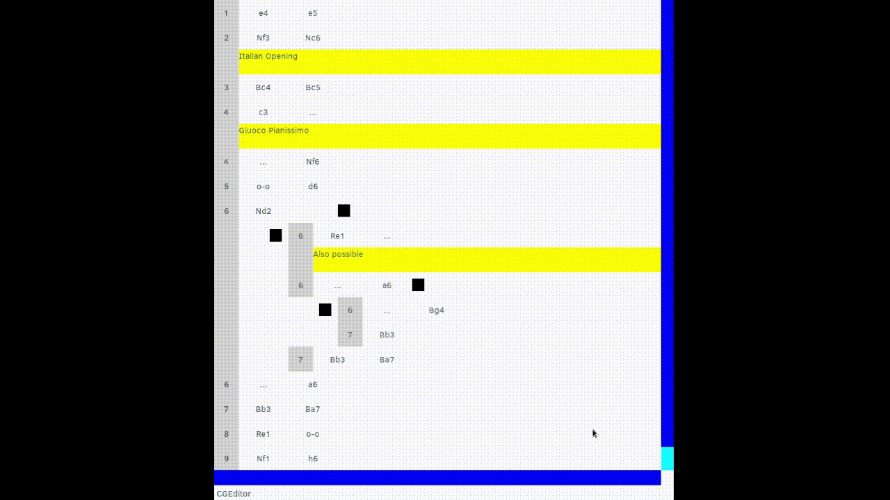

# cgeditor: Chess Game Editor
cgeditor is a dependency-free chess game editor library written in C++. It can be used with any library that provides 2D canvas drawing and mouse inputs features.

# Features
- Show move,move number, variations, NAGs, comments etc.
- *Delete*, *Promote* and *Set as main line* features
- Handle pieces icons
- Its graphical appareance is entirely customizable

# Architecture
To run cgeditor you need to extend 2 classes:
- CGEditor (To draw and handle events)
- CGEHalfMove (The data structure displayed by the editor)

# Example
An example based on *wxWidgets* is available in the `examples/` folder:

